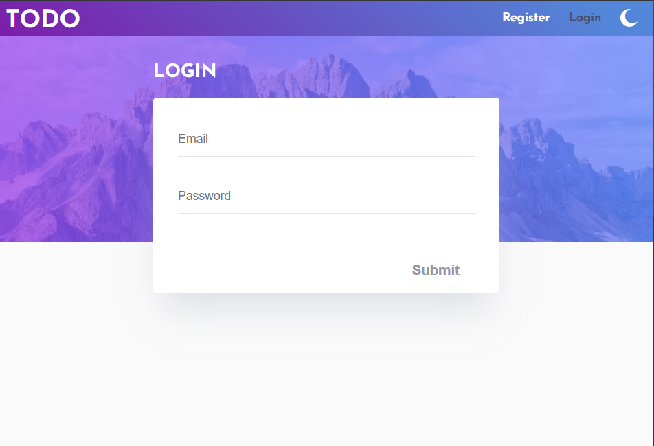

# Frontend Mentor - Todo app solution

This is a solution to the [Todo app challenge on Frontend Mentor](https://www.frontendmentor.io/challenges/todo-app-Su1_KokOW). Frontend Mentor challenges provide you with the design and the assets, its up to the developer to implement.

I took the challenge into a considerably different direction.

## Table of contents

- [Overview](#overview)
  - [The challenge](#the-challenge)
  - [Screenshot](#screenshot)
  - [Links](#links)
- [My process](#my-process)
  - [Built with](#built-with)
  - [What I learned](#what-i-learned)
  - [Continued development](#continued-development)

## Overview

### The challenge

According to the original challenge, users should be able to:

- View the optimal layout for the app depending on their device's screen size
- See hover states for all interactive elements on the page
- Add new todos to the list
- Mark todos as complete
- Delete todos from the list
- Filter by all/active/complete todos
- Clear all completed todos
- Toggle light and dark mode
- **Bonus**: Drag and drop to reorder items on the list

I didnt complete the bonus task because I think the drag and drop api is a hot mess and not worth my time at the moment. I also expanded on the original challenge with:

- Integrate with AWS developer tools for a seamless CI/CD pipeline
- ElasticBeanstalk and Route53 (life hosting redirected to HTTPS)
- AWS RDS
- Cognito user Authentication

### Screenshot

 

### Links

- Solution URL: [GitHub](https://github.com/JDillon522/FrontendMentor-todo-app-react-aws)
- Live Site URL: [Todo](https://todo.steellionllc.com)

## My process

### Built with

- React
  - Recoil
  - React Router
  - Formik
- Nest.js
- Amazon Web Services
  - Code Star
    - CodeCommit
    - CodeBuild
    - CodePipeline
  - ElasticBeanstalk
  - EC2
  - Cognito
  - RDS - Postgres
  - Systems Manager Parameter Store

### What I learned

Lets discuss this in three parts:

__Client Side__

Everywhere you look today there are React jobs left and right. Every bootcamp focuses on React. In all my professional career I've never used React and I've mostly used Angular. So I figured it was time to give it a try.

Right out of the gate here are my big observations about React:
  - React is NOT a framework. It a library of convenient tools to build manageable UI components. Its best use case is on a site where the bulk of the site's content is loaded as a static template and then there are dynamic portions that render later.
  - In order to achieve anything similar to Angular's capabilities you need to kludge together multiple libraries that each operate somewhat different. While this isnt inherently bad it sure is annoying.
  - When done on a  simple scale, React is rather neat and fun to develop with.

One thing I've adamantly concluded about React: **I HATE PUTTING MARKUP AND LOGIC IN THE SAME SPOT**. It is a complete jumbled mess of code to put JS logic inline with html apart from simple `if` conditionals. Writing forms with `Formik` was a nightmare. I also think its abhorrent to go with the "CSS in JS" pattern. This takes a massive elephant dump on the idea of separation of concerns.

Conclusion: React is great for small repeatable components, but I would never again use it as the primary tool. I'd relegate it to widgets.

__2) Server Side__

I used `[Nest.js](https://nestjs.com/)` to handle the backend. Nest is largely inspired by the Angular way of doing things. Its Typescript out of the box and relies heavily on decorators. All things said and done, if I do another Node.js backend I'm positive it'll be with Nest.

__3) AWS__
I spent the overwhelming amount of my time overcoming the learning curve with AWS.

- CodeBuild and CodeCommit: I really liked the features offered by both but I'd probably default to using GitHub for collaboration and task management. AWS just doesn't have the best UI for the job. But CodeBuild is rather nice. I like the demarcative syntax of the YAML `buildspec.yml`.

- CodePipeline and CloudFormation: The pipeline is pretty well designed but the out of the box templates rely on CloudFormation (CF). CF is still considerably cryptic to me but I think I can get my head around it.

- ElasticBeanstalk: EB is more or less an "out of the box" tool that should in theory integrate well with your build environment and an EC2 instance it spins up. The only major issue I had with EB was debugging it and figuring out why something didn't build. The event log isn't always the clearest and I would have to SSH into the EC2 instance and comb through different logs (typically `/var/log/messages`).

- EC2 is pretty straight forward. The most annoying part was figuring out how to get HTTP to redirect to HTTPS (in short, you had to enable a load balancer and then convert the load balancer type to an Application load balancer).

- Route53: This was an interesting rabbit hole to fall into. Once I figured it out though I realized that its very simple to manage.

- RDS with Postgres: This was actually very east to set up. They give you all the connection data you need.

- Systems Manager Parameter Store: I used this vs Secrets Manager because thats what the interwebs said to. Getting parameters out of this was not the most clear and it doesnt integrate with everything. I had to use the AWS SDK to create my own `.env` file ( see [`getEnv.mjs`](./getEnv.mjs))

- Cognito: This is where I spent nearly 30% of my entire development time. From speaking to other AWS gurus I confirmed my suspicions that Cognito is AWS' least documented and most convoluted tool. It is an absolute nightmare trying to figure out how to get it working. On top of that, they offer three different methods to utilize it in your app but they never offer any clear guidance on when to use what. It wasn't until I came across [this article on the subject](https://www.maxivanov.io/aws-cognito-amplify-vs-amazon-cognito-identity-js-vs-aws-sdk/) that I finally realized that I needed to use the SDK.

  - I WILL NOT USE COGNITO AGAIN.
  - I wanted to integrate the app with Google, F-book, etc. but I was so fed up with things by the end that I lost interest.
  - I forgot how annoying rolling your own Authentication UI is and every single edge case you needed to account for. AWS offers Amplify to abstract all that but, once again, its unclear how its all supposed to work.

### Continued development

I liked AWS's pipeline, ElasticBeanstalk, and RDS tools. I've already decided that for my next app I'm going to build a serverless Angular app that hits Lamba functions and may or may not use DynamoDb. I **WILL NOT** use Cognito again. I'll probably use Auth0.
